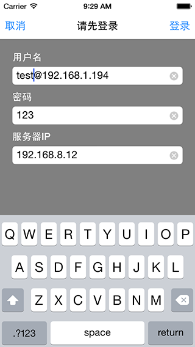

XMPPManager
===========

基于XMPPFramework的 ios端聊天程序



### 配置环境
`XMPPManager`是基于 XMPPFramework的，请先下载配置 ；[https://github.com/robbiehanson/XMPPFramework](https://github.com/robbiehanson/XMPPFramework)			
`XMPPFramework`环境配置 [http://www.cnblogs.com/cocoajin/p/3668373.html](http://www.cnblogs.com/cocoajin/p/3668373.html)

### XMPPManager使用
1. 在 AppDelegate.h 里面导入 `XMPPManager.h`,添加代理 `XMPPManagerDelegate`
2. 在 AppDelegate.m 里面 连接服务器，并实现相应代理即可
	```objective-c
	    //初始化服务器连接管理
    XMPPManager  *manager = [XMPPManager managerWith:ip];
    manager.delegate = self;
    
    [manager setUserName:userName password:pwd];
    BOOL coonect = [manager connectServer];
    if (coonect) {
        NSLog(@"连接成功");
    }
    else
    {
        NSLog(@"连接失败");
    }
	```
	ip: 服务器IP地址，默认端口为 `5222`
	userName:登录用户名；
	pwd:密码
	
3. 实现相应的代理方法即可

### XMPPManager 可用代理方法

查看 `XMPPManagerDelegate.h`
- 用户登录成功代理
- 新用户上线代理
- 用户离线代理
- 收到新消息代理

### Demo使用

```objective-c
- (void)viewDidLoad
{
    [super viewDidLoad];
    
    self.clearsSelectionOnViewWillAppear = YES;
    self.title = @"好友列表";
    
    //先登录
    LoginViewController *loginVC = [[LoginViewController alloc]init];
    UINavigationController *loginNav = [[UINavigationController alloc]initWithRootViewController:loginVC];
    loginVC.delegate = self;
    loginNav.navigationBar.translucent = NO;
    [self.navigationController presentViewController:loginNav animated:YES completion:nil];
    

    

}

//登录页面代理回调用户名和密码
- (void)loginWith:(NSString *)userName pwd:(NSString *)pwd serverIP:(NSString *)ip
{
    //初始化服务器连接管理
    manager = [XMPPManager managerWith:ip];
    manager.delegate = self;
    
    [manager setUserName:userName password:pwd];
    BOOL coonect = [manager connectServer];
    if (coonect) {
        NSLog(@"连接成功");
    }
    else
    {
        NSLog(@"连接失败");
    }
}

#pragma mark XMPPManager 代理；

//收到消息
- (void)didReceiveMessage:(XMPPMessage *)message
{
    NSString *body = [[message elementForName:@"body"] stringValue];
    NSString *displayName = [[message from] user];
    NSLog(@"%@ %@",body,displayName);
    lastChatMessage = body;
    NSIndexPath *thePath = nil;
    if ([onlineUsers containsObject:displayName]&&(pushToChatPage==NO)) {
        
        thePath = [NSIndexPath indexPathForRow:[onlineUsers indexOfObject:displayName] inSection:0];
        TDBadgedCell *theCell = (TDBadgedCell *)[self.tableView cellForRowAtIndexPath:thePath];
        int nums = [theCell.badgeString intValue];
        nums +=1;
        theCell.badgeString = [NSString stringWithFormat:@"%d",nums];
        theCell.detailTextLabel.text = [NSString stringWithFormat:@"新消息: %@",body];
    }
    else
    {
        [[NSNotificationCenter defaultCenter] postNotificationName:@"RECEMESSAGE" object:body];
    }
}

//用户登录
- (void)userLoginSuccess:(XMPPJID *)userJID
{
    NSLog(@"用户：%@ 登录成功",userJID.user);
    
}

//新用户在线
- (void)newUserOnline:(XMPPPresence *)presence
{
    NSLog(@"发现用户：%@ 上线",[[presence from] user]);
    NSString *user = [[presence from] user];
    if (![onlineUsers containsObject:user]) {
        [onlineUsers addObject:user];
    }
    
    if ([offlineUsers containsObject:user]) {
        [offlineUsers removeObject:user];
    }
    
    [self.tableView reloadData];

}

//用户下线
- (void)hasUserOffline:(XMPPPresence *)presence
{
    NSLog(@"发现用户：%@ 离线",[[presence from] user]);
    NSString *user = [[presence from] user];
    if (![offlineUsers containsObject:user]) {
        [offlineUsers addObject:user];
    }
    
    if ([onlineUsers containsObject:user]) {
        [onlineUsers removeObject:user];
    }
    
    [self.tableView reloadData];


}


```


### 反馈
`dev.keke@gmail.com`

